# Enclosure for ESP Mini D1 projects
A simple customizable enclosure for my small ESP projects.
Written in openscad, more to come.

I use it for Bluethooth (BLE) to Home Assistant gateways/proxis with ESPHome.
Currently working on using OpenMQTTgateway to support the RF modules.

#Examples

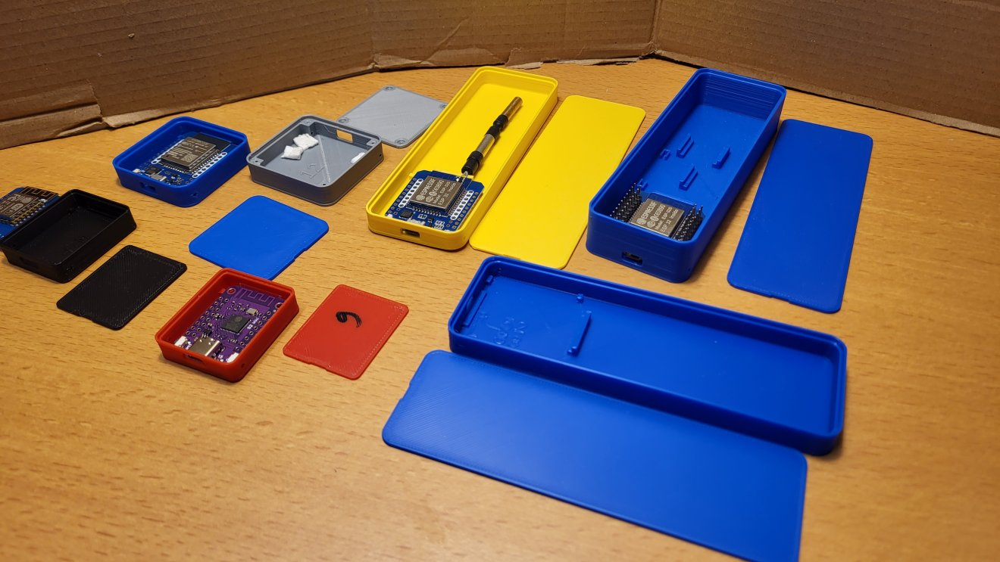

| ESP8266     | ESP32-S2    | ESP32-C3    |
| :----: | :----: | :----: |
| 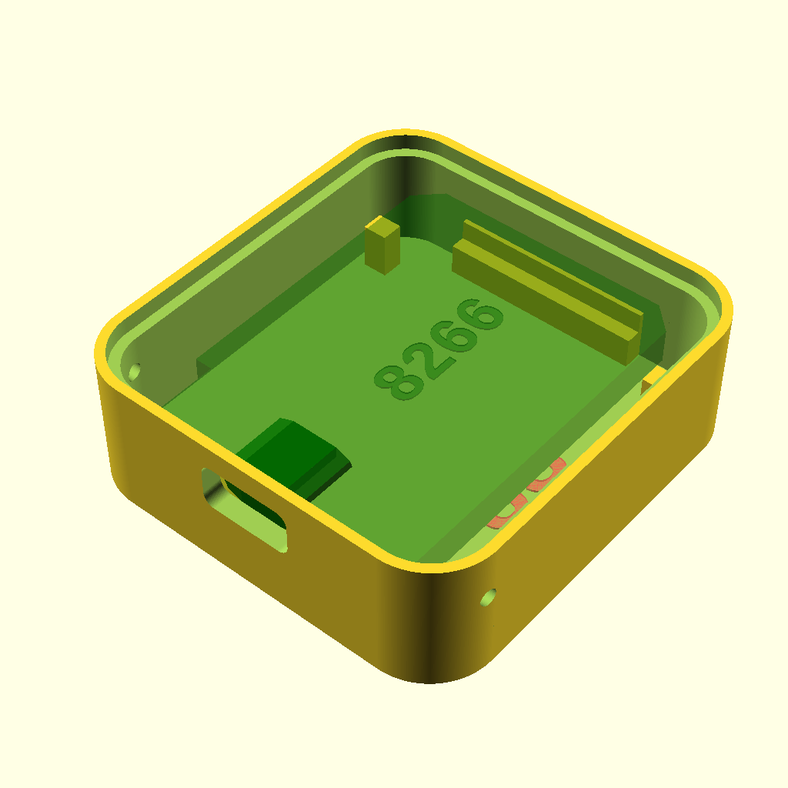 | 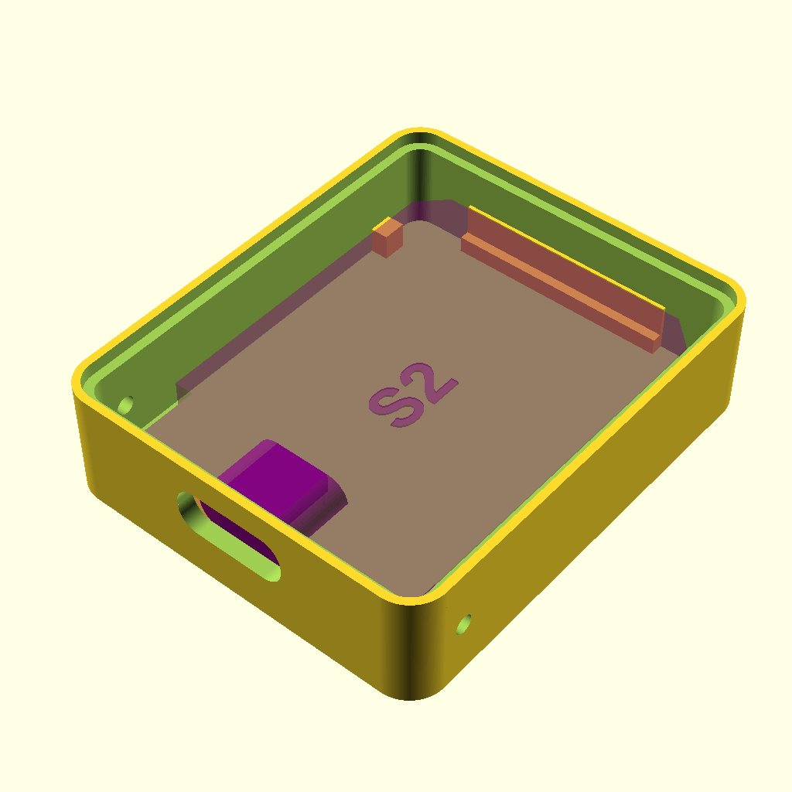 | 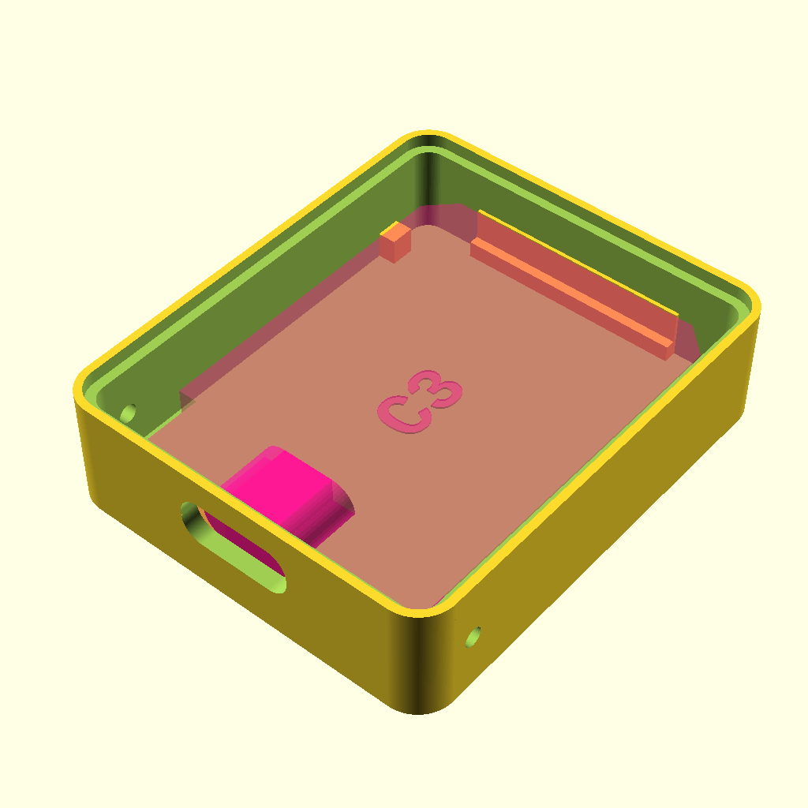 |

| ESP32 | ESP32 with screws | a pressfit Cover |
| :----: | :----: | :----: |
| 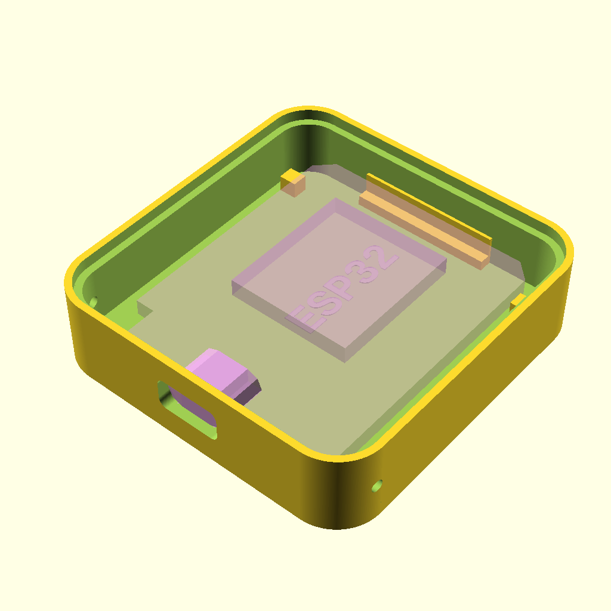 | 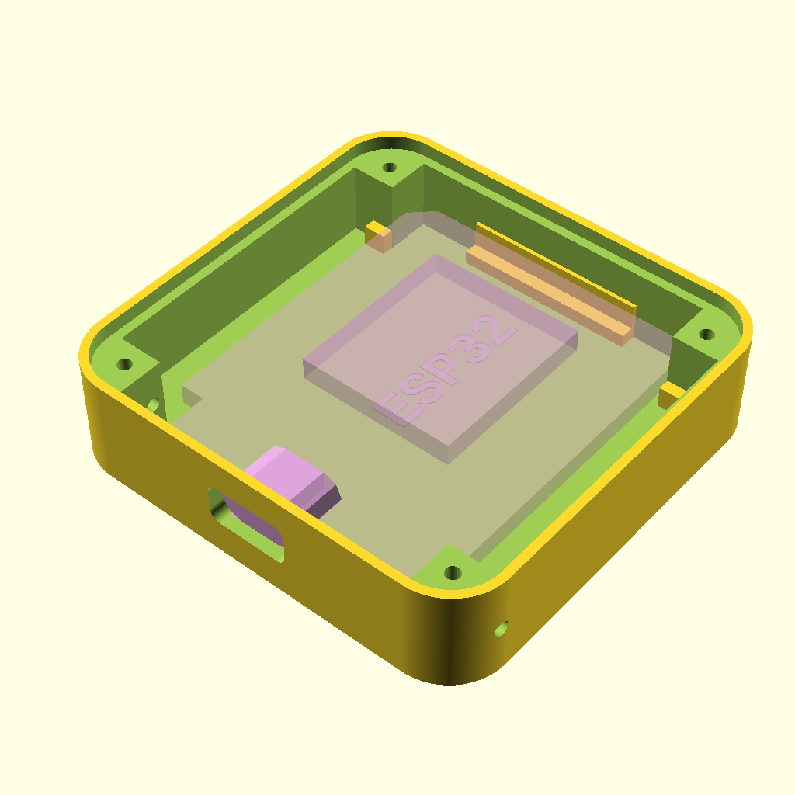 | 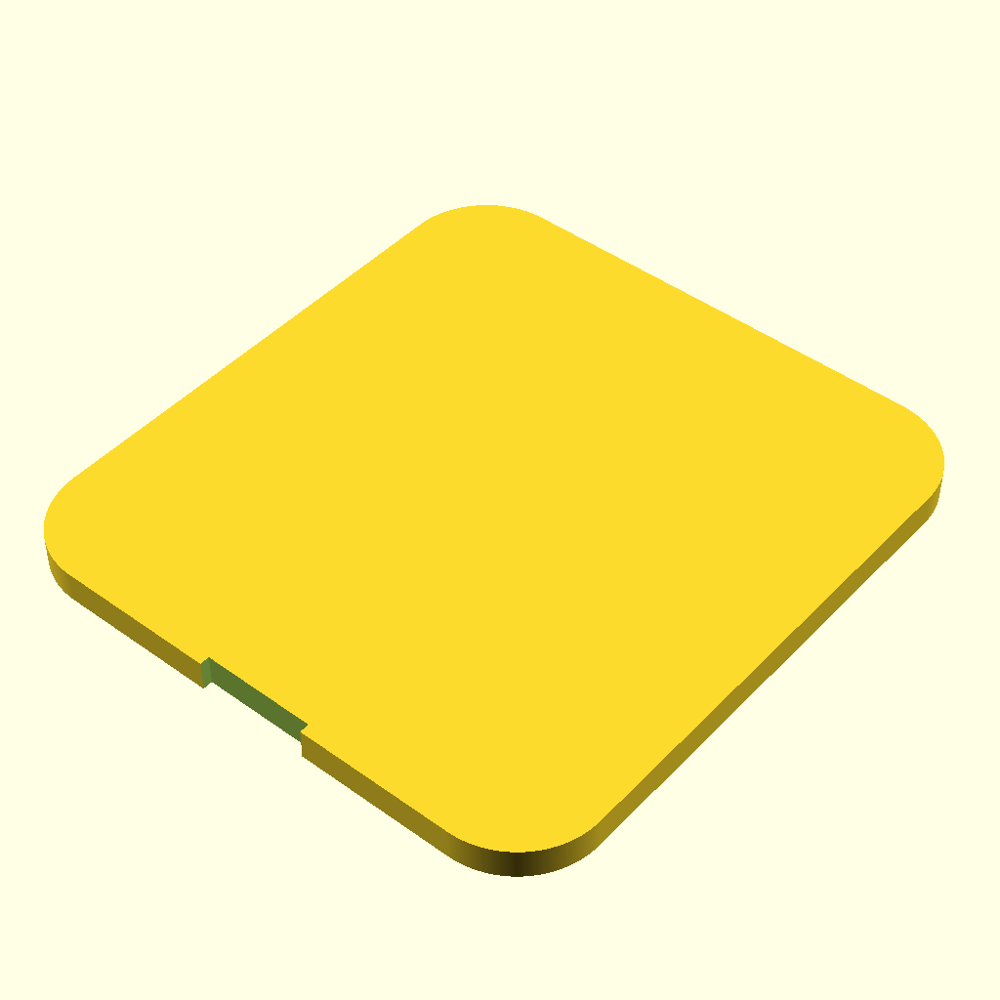 |

| ESP32 with with space for antenna (better receive range BLE proxy) | Using an antenna from an old Fritzbox or similar 2.4 Ghz antennas do increase the range a lot. |
| :----: | :----: |
| 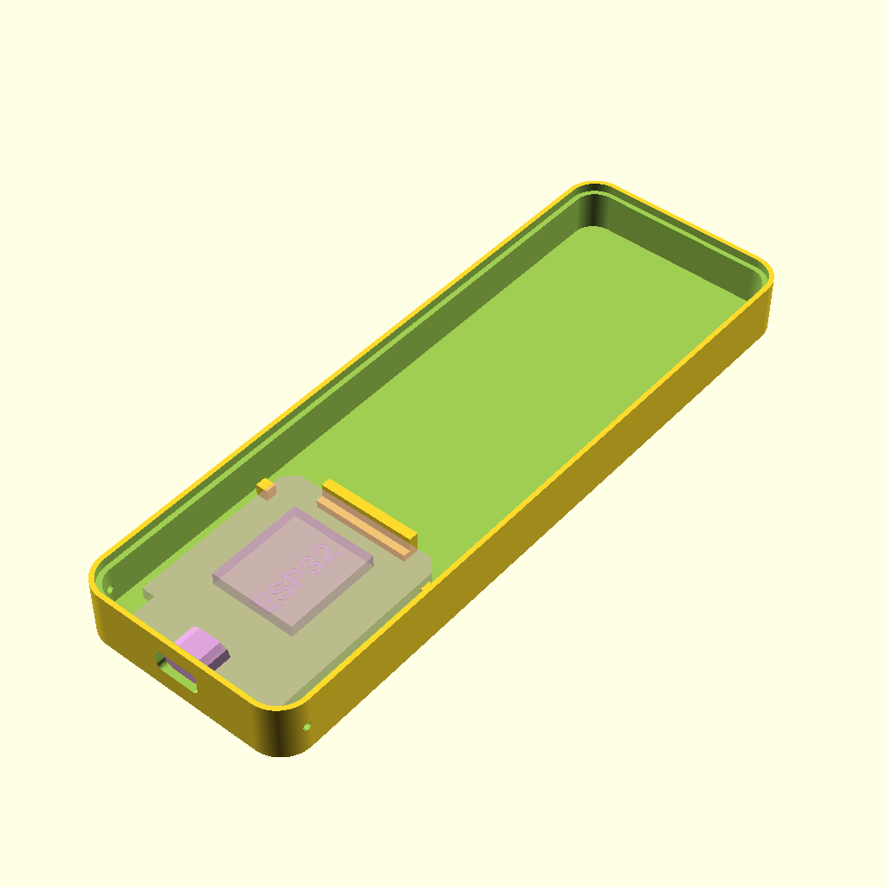 | 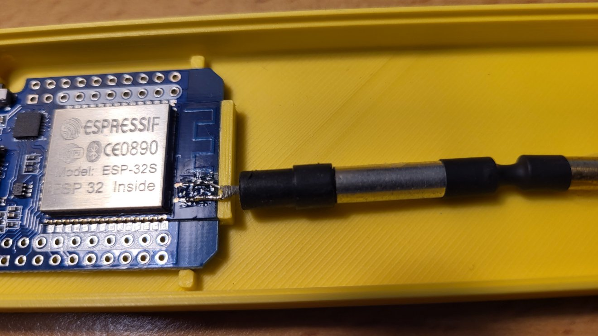 |

| ESP32 with with radios like CC1101 or RFM69 |  |
| :----: | :----: |
| 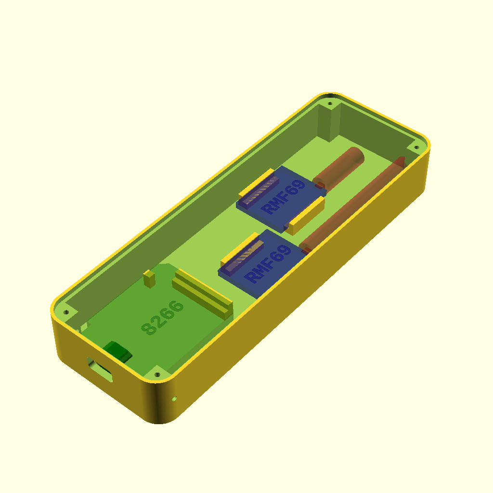 | 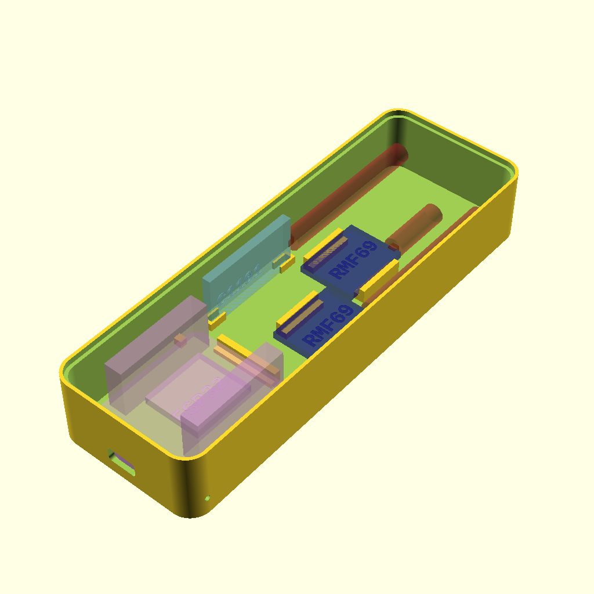 |

# Printing
Find the pictures in directory PNG, the 3D models in STL.

I printed with PLA, 50% infill.

# Customizer
You can choose that it uses screws (2mm self tabbing) or just holds the lid by press fit (works very nice here with my Ender 3 V2).
RF modules can be selected (two of each with own placing).
Flavours of the ESP Mini D1 module can be selected.

## Warning
There might be combinations of parameters that do not fit together.

# Source files
- D1MiniEnclusure.scad
  The box creator, includes the other scad files.
- RfModules.scad
    Defines sizes and models for rf modules like RMF69, CC1101
- EspModules.json
    Defines sizes and models for flavours of Mini D1 (Esp8866, Esp32, ..)
- Makefile
    The control file for make (I use gmake, others not tested).
- svn_rev.scad
    Contains the subversion revision and is automatically created by the Makefile and SubWCRev (subwcrev).
    The revision string gets printed inside the enclosure.

 # Rebuild
    On Linux open a shell in the source directory, then type make and wait.
    The png and stl files will get created. This takes a while, so be patient.
    On Windows, Mac, your are on your own.

    A manual rebuild with openscad is also possible, open D1MiniEnclusure.scad in openscad, select a thing in the customizer (PrintThis), 
    press F6, wait, then F7 to export the stl.
    To much work for me, therefore I created the Makefile.

# Details on the Makefile
    It parses the json file to get the list of things/flavours to build.
    Then it creates pictures in PNG directory and the stl in STL.

    It also checks for a template file (svn_rev.tmpl) and calls SubWCRev to create svn_rev.scad. 
    I do not provide the template file, so this rule will not execute on your machine
	(I provide the svn_rev.scad instead).

    You might also notice that it checks for my library dfLibscad. If found, the libraries tmpl file gets translated into 
    another scad file with a version string of the library.

    I use this Makefile in other projects as well, just the very few first lines need to be adjusted.
    Feel free to reuse it.
